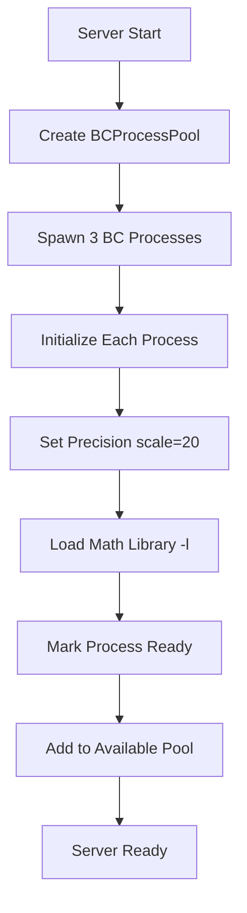
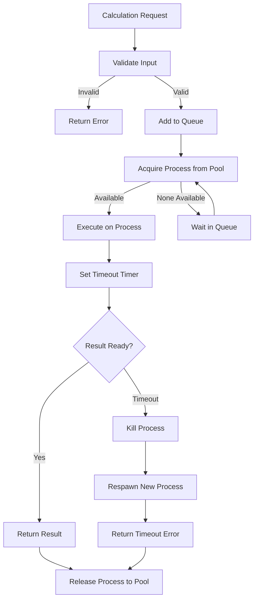
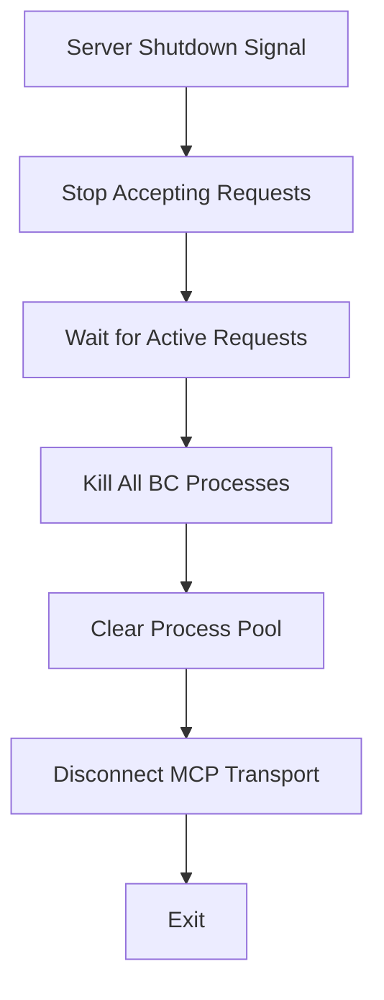

# BC Calculator MCP Server - Architecture Plan

## Overview

This MCP server provides a numerical computation service by integrating with the Unix `bc` (Basic Calculator) command-line tool. It exposes calculation capabilities through the Model Context Protocol, supporting arbitrary precision arithmetic, mathematical functions, and complex expressions.

## Project Structure

```
bc-calculator/
├── package.json              # Project dependencies and scripts
├── tsconfig.json            # TypeScript configuration
├── README.md                # Usage documentation
├── src/
│   ├── index.ts            # Main MCP server entry point
│   ├── bc-process-pool.ts  # Process pool manager
│   ├── bc-process.ts       # Individual BC process wrapper
│   ├── input-validator.ts  # Expression validation & sanitization
│   ├── request-queue.ts    # Concurrent request handler
│   └── types.ts            # TypeScript type definitions
└── build/                   # Compiled JavaScript (generated)
    └── index.js            # Executable server
```

## Core Components

### 1. BCProcessPool Manager

**Purpose**: Manage a pool of BC processes for concurrent request handling

**Design**:
```typescript
class BCProcessPool {
  private processes: BCProcess[] = [];
  private poolSize: number = 3;
  private availableProcesses: BCProcess[] = [];
  private busyProcesses: Set<BCProcess> = new Set();
  
  async initialize(): Promise<void>
  async acquireProcess(): Promise<BCProcess>
  releaseProcess(process: BCProcess): void
  async shutdown(): Promise<void>
  private spawnNewProcess(): BCProcess
  private handleProcessFailure(process: BCProcess): void
}
```

**Features**:
- Pool of 3 BC processes (configurable)
- Automatic respawning on process crashes
- Process health monitoring
- Graceful shutdown with cleanup

### 2. BCProcess Wrapper

**Purpose**: Wrap individual BC process with communication interfaces

**Design**:
```typescript
class BCProcess {
  private process: ChildProcess;
  private isReady: boolean = false;
  private currentRequest: string | null = null;
  
  async start(): Promise<void>
  async evaluate(expression: string, timeout: number): Promise<string>
  async setPrecision(scale: number): Promise<void>
  isAvailable(): boolean
  kill(): void
  
  private handleStdout(data: Buffer): void
  private handleStderr(data: Buffer): void
  private handleExit(code: number): void
}
```

**Features**:
- Spawns BC with `-l` flag (math library)
- Sets initial precision to 20 decimals
- Timeout handling (default: 30 seconds)
- Bidirectional communication via stdin/stdout
- Error capture from stderr
- Process restart on failures

### 3. Input Validator

**Purpose**: Sanitize and validate expressions before BC evaluation

**Design**:
```typescript
class InputValidator {
  private static ALLOWED_CHARS = /^[0-9a-zA-Z+\-*\/^().,;\s=<>!&|%{}[\]]+$/;
  private static DANGEROUS_PATTERNS = [
    /system\s*\(/,
    /exec\s*\(/,
    /`/,
    /\$\(/,
    />\s*\/|<\s*\//  // File redirects
  ];
  
  static validate(expression: string): ValidationResult
  static sanitize(expression: string): string
  private static checkLength(expression: string): boolean
  private static checkDangerousPatterns(expression: string): boolean
}
```

**Security Rules**:
- Maximum expression length: 10,000 characters
- Whitelist: alphanumeric, operators, mathematical symbols
- Blacklist: shell commands, file operations, backticks
- No command injection vectors (`system()`, `exec()`, etc.)

**Allowed BC Features**:
- Basic arithmetic: `+`, `-`, `*`, `/`, `^`, `%`
- Comparison: `<`, `>`, `<=`, `>=`, `==`, `!=`
- Logical: `&&`, `||`, `!`
- Functions: `sqrt()`, `s()`, `c()`, `a()`, `l()`, `e()`
- Variables: `a=5; b=10; a+b`
- Flow control: `if`, `while`, `for`

### 4. Request Queue

**Purpose**: Handle concurrent calculation requests efficiently

**Design**:
```typescript
class RequestQueue {
  private queue: QueuedRequest[] = [];
  private processing: boolean = false;
  
  async enqueue(request: CalculationRequest): Promise<CalculationResult>
  private async processNext(): void
  getQueueLength(): number
}

interface QueuedRequest {
  expression: string;
  precision?: number;
  timeout?: number;
  resolve: (result: CalculationResult) => void;
  reject: (error: Error) => void;
}
```

**Features**:
- FIFO queue processing
- Automatic process allocation from pool
- Promise-based result handling
- Queue status monitoring

## MCP Tools Definition

### Tool 1: `calculate`

**Purpose**: Evaluate basic mathematical expressions

**Schema**:
```typescript
{
  name: "calculate",
  description: "Evaluate mathematical expressions using BC calculator with arbitrary precision",
  inputSchema: {
    type: "object",
    properties: {
      expression: {
        type: "string",
        description: "Mathematical expression to evaluate (e.g., '2+2', 'sqrt(144)', '1/3')"
      },
      precision: {
        type: "number",
        description: "Decimal places for the result (default: 20, range: 0-100)",
        minimum: 0,
        maximum: 100
      }
    },
    required: ["expression"]
  }
}
```

**Example Usage**:
```json
{
  "expression": "355/113",
  "precision": 20
}
```

**Response Format**:
```json
{
  "result": "3.14159292035398230088",
  "expression": "355/113",
  "precision": 20
}
```

### Tool 2: `calculate_advanced`

**Purpose**: Execute advanced BC scripts with variables and multi-line expressions

**Schema**:
```typescript
{
  name: "calculate_advanced",
  description: "Execute advanced BC scripts with variables, functions, and control flow",
  inputSchema: {
    type: "object",
    properties: {
      script: {
        type: "string",
        description: "Multi-line BC script with variables, loops, or functions"
      },
      precision: {
        type: "number",
        description: "Decimal places for results (default: 20)",
        minimum: 0,
        maximum: 100
      }
    },
    required: ["script"]
  }
}
```

**Example Usage**:
```json
{
  "script": "scale=10\na=5\nb=10\na*b+sqrt(a)",
  "precision": 10
}
```

### Tool 3: `set_precision`

**Purpose**: Set global precision for subsequent calculations

**Schema**:
```typescript
{
  name: "set_precision",
  description: "Set the default precision (decimal places) for calculations",
  inputSchema: {
    type: "object",
    properties: {
      precision: {
        type: "number",
        description: "Number of decimal places (0-100)",
        minimum: 0,
        maximum: 100
      }
    },
    required: ["precision"]
  }
}
```

## Error Handling Strategy

### Error Types

1. **Validation Errors**
   - Invalid characters in expression
   - Expression too long
   - Dangerous patterns detected
   - Response: `{ isError: true, message: "Invalid expression: ..." }`

2. **BC Process Errors**
   - Syntax errors in BC expression
   - Runtime errors (division by zero, etc.)
   - Captured from stderr
   - Response: `{ isError: true, message: "BC error: ..." }`

3. **Timeout Errors**
   - Calculation exceeds timeout (default: 30s)
   - Process killed and restarted
   - Response: `{ isError: true, message: "Calculation timeout after 30s" }`

4. **Process Failure Errors**
   - BC process crash
   - Unable to spawn process
   - Pool exhaustion
   - Response: `{ isError: true, message: "Internal server error: ..." }`

### Error Response Format

```typescript
interface ErrorResponse {
  content: [{
    type: "text",
    text: string  // Error message
  }],
  isError: true
}
```

## Process Pool Management

### Initialization Sequence



### Request Handling Flow



### Shutdown Sequence



## Security Measures

### 1. Input Sanitization
- Character whitelist validation
- Maximum length enforcement (10KB)
- Dangerous pattern detection
- No shell metacharacters

### 2. Process Isolation
- Each BC process runs independently
- No shared state between processes
- Process-level resource limits (via timeout)

### 3. Command Injection Prevention
- No shell execution (`shell: false` in spawn)
- Direct BC binary execution
- Validated input only
- No file system access from BC

### 4. Resource Protection
- Calculation timeout (30s default)
- Process pool size limit (3 processes)
- Queue size monitoring
- Memory cleanup on process termination

## Configuration

### Environment Variables
None required - BC is a standard Unix utility

### MCP Settings Configuration

```json
{
  "mcpServers": {
    "bc-calculator": {
      "command": "node",
      "args": ["/home/travis/.local/share/Roo-Code/MCP/bc-calculator/build/index.js"],
      "disabled": false,
      "alwaysAllow": [],
      "disabledTools": []
    }
  }
}
```

## Performance Characteristics

### Expected Performance
- **Single calculation**: <50ms (simple arithmetic)
- **Complex calculation**: <200ms (with math functions)
- **Concurrent requests**: 3 parallel calculations
- **Queue processing**: Sequential, FIFO order

### Scalability
- Process pool: 3 concurrent calculations
- Queue depth: Unlimited (memory-bound)
- Process respawn: Automatic on failures

## Testing Strategy

### Unit Tests
1. Input validation edge cases
2. Dangerous pattern detection
3. Expression sanitization
4. Error message formatting

### Integration Tests
1. Basic arithmetic operations
2. Math library functions (`sqrt`, `sin`, `cos`)
3. Variable assignment and usage
4. Multi-line scripts
5. Precision handling
6. Timeout scenarios
7. Concurrent requests
8. Process failure recovery

### Test Examples

```typescript
// Basic arithmetic
calculate("2+2") // → "4"
calculate("355/113", precision: 10) // → "3.1415929204"

// Math functions (with -l library)
calculate("sqrt(2)", precision: 15) // → "1.414213562373095"
calculate("s(3.14159/2)", precision: 10) // → "1.0000000000" (sine)

// Advanced scripts
calculate_advanced(`
  scale=5
  pi=4*a(1)
  pi*2
`) // → "6.28318"

// Error cases
calculate("2/0") // → Error: division by zero
calculate("system('ls')") // → Error: invalid expression
```

## Dependencies

```json
{
  "dependencies": {
    "@modelcontextprotocol/sdk": "^1.0.4"
  },
  "devDependencies": {
    "@types/node": "^20.10.0",
    "typescript": "^5.3.0"
  }
}
```

## Implementation Timeline

Based on the todo list, the implementation follows this sequence:
1. Project setup (todos 1-3)
2. Core components (todos 4-6)
3. MCP tools (todos 7-9)
4. Error handling & validation (todos 10, 13-14)
5. Request management (todos 11-12)
6. Build & deployment (todos 15-16)
7. Testing & documentation (todos 17-20)

## Future Enhancements

1. **Statistics**: Track calculation count, average time, errors
2. **Caching**: Cache frequent calculations
3. **Extended Functions**: Add custom BC function library
4. **Graphing**: Generate ASCII graphs of functions
5. **Batch Processing**: Evaluate multiple expressions in one call
6. **History**: Maintain calculation history per session